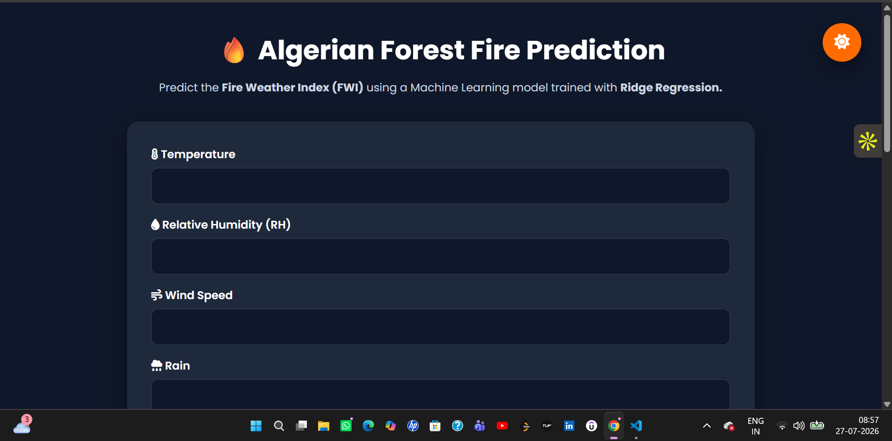
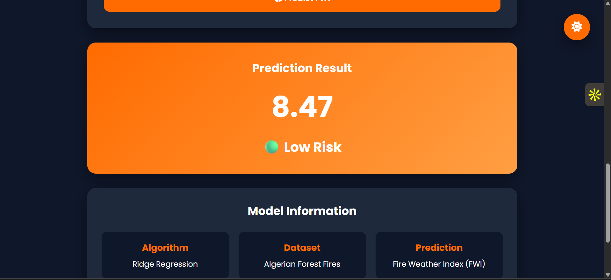

# 🔥 Algerian Forest Fire Prediction

A Machine Learning web application that predicts the Fire Weather Index (FWI) for the Algerian Forest Fire dataset using Ridge Regression. The application is built with Flask and deployed on Render.

## 🌐 Live Demo

https://algerian-forest-fire-prediction-6.onrender.com/

---

## 📌 Project Overview

Forest fires pose a significant environmental and economic threat. This project leverages Machine Learning to predict the Fire Weather Index (FWI), helping estimate fire risk based on weather conditions.

The model is trained on the Algerian Forest Fire Dataset and deployed as a responsive web application.

---

## 🚀 Features

- Predicts Fire Weather Index (FWI)
- Interactive Flask Web Interface
- Responsive UI
- Input Validation
- Risk Level Classification
- Deployed on Render
- Fast Predictions using a trained Ridge Regression model

---

## 📸 Application Preview





---

## 🧠 Machine Learning Workflow

1. Data Collection
2. Data Cleaning
3. Exploratory Data Analysis (EDA)
4. Feature Engineering
5. Data Scaling
6. Model Training
7. Model Evaluation
8. Model Deployment using Flask & Render

---

## 📊 Input Features

- Temperature
- Relative Humidity (RH)
- Wind Speed (Ws)
- Rain
- FFMC
- DMC
- ISI
- Classes
- Region

---

## 🤖 Model Used

- Ridge Regression

The model was selected after comparing multiple regression algorithms and provided strong predictive performance for this dataset.

---

## 🛠 Tech Stack

- Python
- Flask
- Scikit-learn
- NumPy
- HTML
- CSS
- JavaScript
- Gunicorn
- Render

---

## 📂 Project Structure

```
Algerian_Forest_Fire_Prediction/
│
├── app.py
├── ridge.pkl
├── scaler.pkl
├── requirements.txt
├── runtime.txt
├── Procfile
├── templates/
│   └── index.html
├── static/
│   ├── style.css
│   └── script.js
└── README.md
```

---

## ⚙️ Installation

Clone the repository

```bash
git clone https://github.com/Adarsh282504/Algerian_Forest_Fire_Prediction.git
```

Move into the project

```bash
cd Algerian_Forest_Fire_Prediction
```

Install dependencies

```bash
pip install -r requirements.txt
```

Run the application

```bash
python app.py
```

---

## 📈 Future Improvements

- Deploy with Docker
- Add Explainable AI (SHAP)
- Feature Importance Visualization
- REST API
- Model Monitoring
- Cloud Deployment using AWS

---

## 👨‍💻 Author

**Adarsh Raj Alok**

GitHub:
https://github.com/Adarsh282504


---

⭐ If you found this project useful, consider giving it a star!